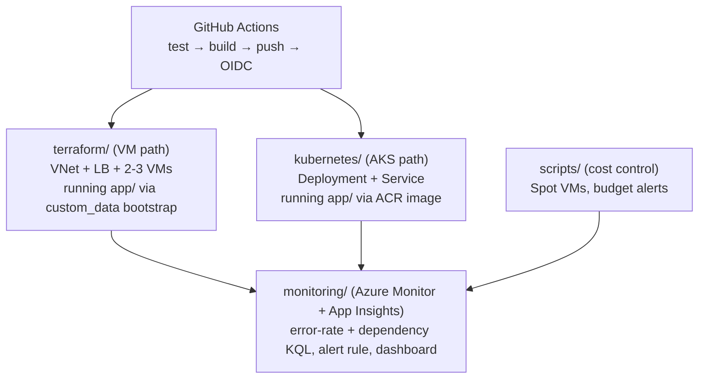

# Azure DevOps Labs

Runnable, end-to-end companion code for the Azure articles on [Dumka Esaenwi's technical blog](https://dumkaesaenwi.pages.dev). This isn't isolated snippets — it's one coherent project: a sample app, the infrastructure that runs it, the pipeline that deploys it, and the monitoring that watches it, exactly as described across five articles.

## Architecture



## Contents

| Folder | Article | What's runnable |
| --- | --- | --- |
| [`app/`](app) | — | The sample Express service every other folder deploys. `GET /health` is what the load balancer, AKS readiness probe, and CI smoke test all check. |
| [`terraform/`](terraform) | Terraform on Azure: Infrastructure as Code with the azurerm Provider | Full VNet + VM + Load Balancer module, wired end-to-end (backend pool, health probe, LB rule — not just declared resources sitting unconnected). Staging and production `.tfvars`. |
| [`github-actions/`](github-actions) | Building a CI/CD Pipeline to AKS with GitHub Actions | OIDC-authenticated pipeline: runs `app/`'s tests, builds the image, pushes to ACR, applies the K8s manifests, rolls out, then smoke-tests the live endpoint. |
| [`kubernetes/`](kubernetes) | Kubernetes on Azure: AKS vs. Self-Managed | StorageClass, cluster provisioning script, and the actual Deployment/Service/PodDisruptionBudget the pipeline deploys. |
| [`scripts/`](scripts) | Cost Optimization on Azure | Spot VM creation and a two-threshold budget alert (actual + forecasted spend). |
| [`monitoring/`](monitoring) | Monitoring and Observability on Azure | Two KQL queries (error rate, dependency health), a scheduled alert rule, and a dashboard definition covering all four. |

## Running it end to end

```bash
# 1. Provision the VM-based path
cd terraform
terraform init
terraform apply -var-file=environments/staging.tfvars

# 2. Or provision AKS instead
cd ../kubernetes
./create-cluster.sh

# 3. Build and test the app locally
cd ../app
npm install
npm test

# 4. Wire up CI (copy github-actions/deploy-aks.yml to .github/workflows/)
#    and push — it builds, deploys to AKS, and smoke-tests the live endpoint.

# 5. Wire up monitoring once traffic is flowing
cd ../monitoring
./alert-rule.sh
```

## Prerequisites

- [Azure CLI](https://learn.microsoft.com/cli/azure/install-azure-cli) (`az`), logged in: `az login`
- [Terraform](https://developer.hashicorp.com/terraform/install) >= 1.5
- `kubectl`, `docker`, `node` >= 18

## Why it's structured this way

Each article makes a specific claim — that a Terraform module should wire the load balancer to real backends, that a CI pipeline should smoke-test before calling a deploy done, that an alert should require three consecutive breaches before paging. This repo is the proof: every one of those claims is checked-in, working code, not a code block that only looks right.
